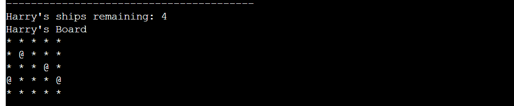

# BATTLESHIP SKIRMISH
Battleship Skirmish is a Python terminal game that is based off of the popluar board game, [Battleships](https://en.wikipedia.org/wiki/Battleship_(game)). It runs in the [Code Institute](https://codeinstitute.net/) mock terminal on [Heroku](https://www.heroku.com).
# How To Play
1. The player enters their name.
2. The player confirms that they are ready to play.
3. Ships are then randomly assigned to both the players and the computers board.
4. The player will then guess a row on the computer's board to attack.
5. The player will then guess a column on the computer's board to attack.
    * If the player has hit a ship, the coordinate will be marked with an 'X'.
    * If the player has missed a ship, the coordinate will be marked with an 'O'.
6. The computer will randomly guess a coordinate to attack on the player's board.
7. The first to destroy all of their opponents ship will win the game.
# Features
## Existing Features
### Player Name
When the player enters their name at the start of the game, this transfers throughout and is used to display their boards and remaining ships. This helps to make the experience more personal.
    
