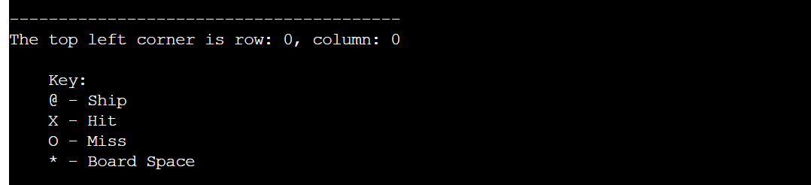

# BATTLESHIP SKIRMISH
Battleship Skirmish is a Python terminal game that is based off of the popluar board game, [Battleships](https://en.wikipedia.org/wiki/Battleship_(game)). It runs in the [Code Institute](https://codeinstitute.net/) mock terminal on [Heroku](https://www.heroku.com).
# How To Play
1. The player enters their name.
2. The player confirms that they are ready to play.
3. Ships are then randomly assigned to both the players and the computers board.
4. The player will then guess a row on the computer's board to attack.
5. The player will then guess a column on the computer's board to attack.
    * If the player has hit a ship, the coordinate will be marked with an 'X'.
    * If the player has missed a ship, the coordinate will be marked with an 'O'.
6. The computer will randomly guess a coordinate to attack on the player's board.
7. The first to destroy all of their opponents ship will win the game.
# Features
## Current Features
### Player Name
When the player enters their name at the start of the game, this transfers throughout and is used to display their boards and remaining ships. This helps to make the experience more personal.
    
### Key
A key is displayed at the start of the game to show what each symbol represents on the board. This helps prevent confusion for the player, improving the experience.
    
### Random Board Generation
The ships are randomly generated onto both the player's and the computer's board, making each game unique and differnt. The computer's ships remain hidden to the player but the player can still see where their ships are located.
### Ship Counter
The amount of ships remaining for the player and the computer are displayed so the player knows if they are winning or loosing, making the gaming easier to follow.
### Player Resume / Quit
After each turn the player is given the option to quit, allowing them to end the game if they so wish.
### Hit / Miss feedback
The player is made aware if their attack and the computer's attack was a hit or a miss. This helps the player stay updated with the current situation of the game and makes it easier to follow.
### Input Validation
If thwe player tries to select a coordinate that they have already chosen, is out of bounds or enters an input that is not a number, the player is instructed to enter a number from 0 to 4. This allows the player to choose another coordinate with disruoting the flow of the game, improving the user experience. 
## Future Features
### Display Computer Coordinate Selection
I want to display the computer coordinate selection (e.g "The Computer attacked (2, 3)"), as this will give more feedback to the user and make the game clearer, improving their experience.
### Custom Board Size and Amount of Ships Assigned
