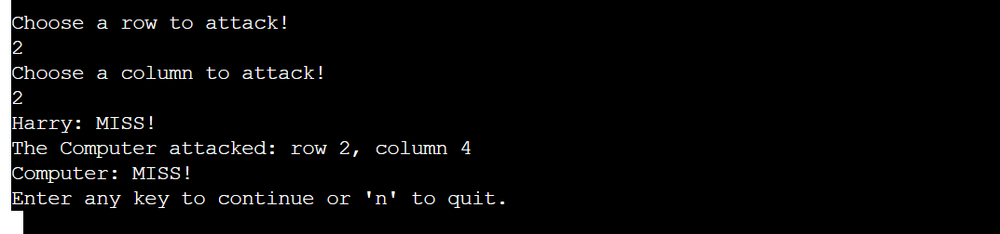
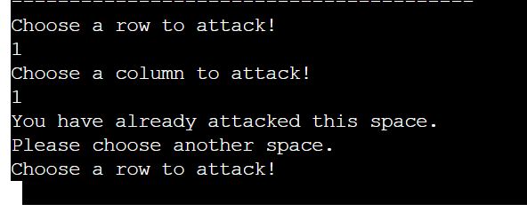
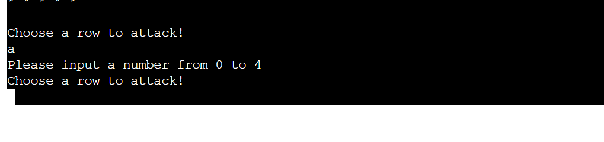

# BATTLESHIP SKIRMISH
Battleship Skirmish is a Python terminal game that is based off of the popluar board game, [Battleships](https://en.wikipedia.org/wiki/Battleship_(game)). It runs in the [Code Institute](https://codeinstitute.net/) mock terminal on [Heroku](https://www.heroku.com).
# How To Play
1. The player enters their name.
2. The player confirms that they are ready to play.
3. Ships are then randomly assigned to both the players and the computers board.
4. The player will then guess a row on the computer's board to attack.
5. The player will then guess a column on the computer's board to attack.
    * If the player has hit a ship, the coordinate will be marked with an 'X'.
    * If the player has missed a ship, the coordinate will be marked with an 'O'.
6. The computer will randomly guess a coordinate to attack on the player's board.
7. The first to destroy all of their opponents ship will win the game.
# Features
## Current Features
### Player Name
When the player enters their name at the start of the game, this transfers throughout and is used to display their boards and remaining ships. This helps to make the experience more personal.
    
### Key
A key is displayed at the start of the game to show what each symbol represents on the board. This helps prevent confusion for the player, improving the experience.
    
### Random Board Generation
The ships are randomly generated onto both the player's and the computer's board, making each game unique and differnt. The computer's ships remain hidden to the player but the player can still see where their ships are located.
### Ship Counter
The amount of ships remaining for the player and the computer are displayed so the player knows if they are winning or loosing, making the gaming easier to follow.
### Player Resume / Quit
After each turn the player is given the option to quit, allowing them to end the game if they so wish.
### Hit / Miss feedback
The player is made aware if their attack and the computer's attack was a hit or a miss. This helps the player stay updated with the current situation of the game and makes it easier to follow.
    
### Input Validation
If the player tries to select a coordinate that they have already chosen, is out of bounds or enters an input that is not a number, the player is instructed to enter a number from 0 to 4. This allows the player to choose another coordinate with disruoting the flow of the game, improving the user experience. 
    


## Future Features
### Custom Board Size and Amount of Ships Assigned
I want to give the player the ability to customize the size of the board, allowing more replayablity for the user and enhancing their experience.
# Data Model
I opted for a Board Class as my data model because it allowed to create two instances to hold the player and the computer boards.

The Board Class stores information such as the board size, the number of ships to assign, the board type (player or computer) and the guesses for each board.

The class also has a method, `assign_ships`, that is used to randomly assign the ships to the board.
# Testing
I have manually tested this project in the following ways:
* I passed the code through a PEP8 linter in order to ensure there were not any issues.
* Purposely tested for invalid inputs, for example, inputing letters when numbers are expected and inputing numbers that are out of bounds.
* Thoughly tested in my local terminal and the Code Institute Heroku terminal.
# Bugs
## Solved Bugs
* Received Value Errors if an input was Not a Number and Index Errors if the the number input was out of bounds. To remedy this I used try and except statements to bypass the errors without the game being interupted for the user.
## Remaing Bugs
* Occassionally, when the game displays which coordinate the computer has chosen, it also displays previous coordinates that the computer has chosen as well. This does not directly affect the game progression but can be confusing for the player. Because this happens inconsistently it is hard to understand what triggers this.
 
# Deployment
This project was deployed using Code Institute's mock terminal for Heroku.
## Steps For Deployment
1. Fork or clone this [Github](https://github.com/) Repository.
2. Create a New App on [Heroku](https://www.heroku.com).
3. Set the buildbacks to `Python` and `NodeJS`, in the order.
4. Link the Heroku App to the Github Repository.
5. Click on **Deploy**.
## Forking the Github Repository
By Forking the Github Repository we create a copy of the original Repository that we can use to view and make changes. This can be done using the following steps.

1. Log in to GitHub and locate the GitHub Repository.
2. In the top-right corner of the Repository locate the "Fork" Button.
3. Once clicked on, you should have a copy of the original repository in your GitHub account.

## Making a Local Clone
1. Log into [Github](https://github.com/) and locate the Github Repository.
2. Click on the green "Code" button.
3. To clone the repository using HTTPS, under "Clone with HTTPS", copy the link.
4. Open in Git Bash
5. Change the current working directory to the location where you want the cloned directory to be made.
6. Type `git clone`, and then paste the URL you copied in Step 3.
```
$ git clone https://github.com/YOUR-USERNAME/YOUR-REPOSITORY
```
7. Press Enter. Your local clone will be created.

```
$ git clone https://github.com/YOUR-USERNAME/YOUR-REPOSITORY
> Cloning into `CI-Clone`...
> remote: Counting objects: 10, done.
> remote: Compressing objects: 100% (8/8), done.
> remove: Total 10 (delta 1), reused 10 (delta 1)
> Unpacking objects: 100% (10/10), done.
```

Click [Here](https://help.github.com/en/github/creating-cloning-and-archiving-repositories/cloning-a-repository#cloning-a-repository-to-github-desktop) to retrieve pictures for some of the buttons and more detailed explanations of the above process.
# Credits
## Code
* The following code is derived from [this](https://stackoverflow.com/questions/30521975/print-a-nested-list-line-by-line-python) Stack Overflow thread:
```
[print(*row) for row in player.size]
```
The purpose of this code is to print the boards in a grid format.
* The following code is credited to the Code Institute Tutor Support Team:
```
rand_index = [random.randint(0, 4), random.randint(0, 4)]
while self.size[rand_index[0]][rand_index[1]] == ship:
    rand_index = [random.randint(0, 4), random.randint(0, 4)]

self.size[rand_index[0]][rand_index[1]] = ship
```
The purpose of this code is to chose a random column and row for the computer to choose to attack. If the random coordinate has already been chosen then it will choose another random row and column.
* The following code in derived from [this](https://stackoverflow.com/questions/40514139/check-if-an-item-is-in-a-nested-list) Stack Overflow thread:
```
 while (any("@" in row for row in player.size) and
        any("@" in row for row in computer.size)):
```
The purpose of this code is to search for any ships on the player and the computer boards.
* The following code derived from [this](https://stackoverflow.com/questions/5828123/nested-list-and-count ) Stack Overflow thread:
```
player_ships = sum(x.count("@") for x in player.size)
computer_ships = sum(x.count("@") for x in computer.size)
```
The purpose of this code is to keep track of the remaining player and computer ships.
# Acknowledgements
* I would like to thank my Mentor, Jack Wachira for their quality and continuous feedback.
* I would like to thank the Code Institute Tutor Support for their assistance, patience and desire to help others.
# Supporting Documentation
[Click here](https://lucid.app/lucidchart/93403f93-4924-406d-85e7-c573f73c4f7c/edit?viewport_loc=-103%2C112%2C1779%2C749%2C0_0&invitationId=inv_7d56f041-ab8a-4ce2-a01c-13d1052d05a3) to view the flowchart that I constructed, using Lucid Chart, while planning the logic for the game.